# Lending Club Credit Scoring

# 1. Projektbeschreibung

- In diesem Projekt werde ich drei Machine-Learning-Modelle entwickeln, um die drei Komponenten des erwarteten Verlusts im Kontext des **Kreditrisikomodells** beim **Lending Club** (einem Peer-to-Peer-Kreditunternehmen) vorherzusagen: **Wahrscheinlichkeit eines Zahlungsausfalls (Probability of Default, PD), Exposition zum Zeitpunkt des Ausfalls (Exposure at Default, EAD) und Verlust bei Ausfall (Loss Given Default, LGD)**. Der erwartete Verlust wird als Produkt dieser Elemente berechnet: Erwarteter Verlust (EL) = PD * EAD * LGD. Diese Modelle werden verwendet, um eine Kreditrichtlinie zu erstellen, die darüber entscheidet, ob neuen Antragstellern basierend auf ihrer Kreditwürdigkeit und den erwarteten Verlusten auf Krediten ein Kredit gewährt wird oder nicht. Durch die Schätzung des erwarteten Verlusts (EL) für jeden Kredit kann der Lending Club zudem das erforderliche Kapital bewerten, das zur Absicherung gegen Zahlungsausfälle vorgehalten werden muss.

- Das PD-Modell umfasst ein unausgeglichenes binäres Klassifikationsproblem, bei dem das Ziel 1 ist, wenn kein Zahlungsausfall vorliegt, und 0, wenn ein Zahlungsausfall auftritt (Minderheitsklasse). Es wird ein logistisches Regressionsmodell entwickelt.

- Die LGD- und EAD-Modellierung umfasst ein Beta-Regressionsproblem, d. h. eine Regressionsaufgabe, bei der die abhängigen Variablen beta-verteilt sind, nämlich die Recovery Rate und der Credit Conversion Factor.

# 2. Geschäftliches Problem und Ziele

**2.1 Was ist der Lending Club?**
- LendingClub ist eine Peer-to-Peer-Kreditplattform, die es Privatpersonen ermöglicht, direkt Geld zu verleihen und zu leihen, ohne traditionelle Finanzinstitute wie Banken einzubeziehen. Die Plattform fungiert als Online-Marktplatz, der Kreditnehmer, die einen Kredit benötigen, mit Investoren verbindet, die bereit sind, diese Kredite zu finanzieren.

**2.2 Was ist das geschäftliche Problem?**
- LendingClub steht vor der Herausforderung, Zahlungsausfallrisiken effektiv zu managen, während gleichzeitig die Renditen für Investoren optimiert werden. Da die Plattform Peer-to-Peer-Kredite vermittelt, ist sie auf genaue Risikobewertungen angewiesen, um ein nachhaltiges und profitables Kreditgeschäft aufrechtzuerhalten.

- Der CEO möchte Erkenntnisse darüber gewinnen, welche Faktoren mit Kreditrisiken in Verbindung stehen, und Modelle entwickeln, die die Ausfallwahrscheinlichkeit (Probability of Default, PD) neuer Antragsteller sowie mögliche Verluste auf bestehende Kredite vorhersagen. Dadurch soll eine Kreditrichtlinie etabliert werden, die bestimmt, wann ein Kredit bewilligt oder abgelehnt wird.

- Eine wichtige Anforderung ist, dass die Modelle leicht verständlich sein müssen. Da das Unternehmen im Online-Bereich tätig ist, sind Transparenz und Kundenzufriedenheit entscheidend. Daher müssen wir nachvollziehbar erklären können, warum ein Kredit genehmigt oder abgelehnt wird.

**2.3 Was sind die Projektziele und Vorteile?**
1. Identifizierung der Faktoren, die mit Kreditrisiken verbunden sind, um geschäftliche Einblicke zu gewinnen.

2. Entwicklung eines genauen Probability of Default (PD) Modells, um eine Scorecard zu erstellen. Diese wird LendingClub helfen, zu entscheiden, ob einem neuen Antragsteller ein Kredit gewährt wird oder nicht (Antragsmodell), basierend auf Kreditbewertungen.

3. Entwicklung von Exposure at Default (EAD) und Loss Given Default (LGD) Modellen, um den Erwarteten Verlust (Expected Loss, EL) zu schätzen. Dies ermöglicht es LendingClub, ausreichend Kapitalreserven zu halten, um sich gegen Zahlungsausfälle zu schützen.

4. Verbesserung des Risikomanagements und Optimierung der Renditen, indem eine Kreditrichtlinie erstellt wird, die das Risiko und die Kapitalrendite (ROI) von LendingClub ausbalanciert.

5. Anwendung von Modellüberwachung und Wartung, um sicherzustellen, dass die Modelle weiterhin gültig bleiben. Wenn sich die Eigenschaften der Antragsteller erheblich ändern, können wir das Modell anpassen oder neu entwickeln.

**2.4 Wichtige Konzepte im Kontext des Kreditrisikos**

- **Finanzinstitute**, wie LendingClub und Online-Kreditplattformen, verdienen Geld durch die Vergabe von Krediten. Sie erheben Zinsen, die eine wesentliche Einkommensquelle sind. Ein effektives Kreditrisikomanagement ist entscheidend, um sicherzustellen, dass Kreditnehmer ihre Schulden zurückzahlen und Verluste vermieden werden.

- **Kreditrisiko** bezeichnet die Möglichkeit, dass ein Kreditnehmer seinen finanziellen Verpflichtungen nicht nachkommt, was zu Verlusten für den Kreditgeber führen kann. Wenn ein Kreditnehmer seine Schulden nicht fristgerecht begleicht, spricht man von einem "Zahlungsausfall" (Default). Dieser wird oft anhand eines bestimmten Zeitraums definiert – z. B. wird ein Kreditnehmer als ausgefallen betrachtet, wenn er seine **Zahlungen 90 Tage** überfällig ist.

- Wichtige Regulierungen im Kreditmarkt stellen sicher, dass Finanzinstitute transparent und stabil arbeiten:

  - **Basel III** stellt sicher, dass Banken über ausreichend Kapital (Kapitalanforderungen) verfügen und Kreditrisiken korrekt bewerten.

  - Der Internal **Ratings-Based Approach (IRB-A)** erlaubt Banken, Kreditrisiken mithilfe der Konzepte PD, EAD und LGD selbst zu bestimmen.

  - **IFRS 9 (International Financial Reporting Standard 9)** bietet Richtlinien zur Bewertung von Finanzanlagen. Im Gegensatz zu Basel III, das sich auf ein Jahr konzentriert, betrachtet IFRS 9 die Wahrscheinlichkeit eines Zahlungsausfalls über die gesamte Laufzeit eines Kredits.

- **Der "Expected Loss (EL)" (Erwartete Verlust)** ist die durchschnittliche geschätzte Verlustsumme, die ein Kreditgeber aus ausgefallenen Krediten erwarten kann. Er basiert auf drei Faktoren:

    - **Probability of Default (PD)** – Wahrscheinlichkeit, dass ein Kreditnehmer ausfällt.

   - **Loss Given Default (LGD)** – Anteil des ausgefallenen Kredits, der nicht zurückgewonnen werden kann.

   - **Exposure at Default (EAD)** – Betrag, der zum Zeitpunkt des Ausfalls aussteht.

- **LendingClub nutzt ein "PD-Modell/Kreditbewertungsmodell"**, um die Kreditwürdigkeit von Antragstellern anhand ihrer Kreditbewertungen einzuschätzen. Dies hilft bei der Entscheidung, ob ein Kredit bewilligt oder abgelehnt wird.

- **Das benötigte Kapital** zur Absicherung gegen Zahlungsausfälle wird mithilfe der EAD- und LGD-Modelle berechnet, um den Expected Loss (EL) zu schätzen. Dies trägt dazu bei, Risiken im Kreditgeschäft zu minimieren.

- Bei der Erstellung eines Kreditbewertungsmodells gibt es zwei Ansätze:

   - Antragsmodell ("Application Model"): Bewertet die Kreditwürdigkeit basierend auf Daten zum Zeitpunkt der Antragstellung.

   - Verhaltensmodell ("Behavior Model"): Analysiert das Kreditverhalten nach der Kreditvergabe.

- **Eine "Kreditrichtlinie"** ist eine Sammlung von Richtlinien, die Finanzinstitute zur Bewertung und Steuerung von Kreditrisiken verwenden. Dazu gehören Faktoren wie erwartete Rendite, Kreditbewertungen, Risikoklassen und erwartete Verluste.

- **"Return on Investment (ROI)"** ist eine zentrale Kennzahl zur Messung der Rentabilität eines Kredits. Ein ausgewogenes Verhältnis zwischen ROI und Risiko ist essenziell für ein effektives Kreditrisikomanagement. Höhere Risiken können höhere Renditen bieten, gehen jedoch mit einer höheren Wahrscheinlichkeit eines Zahlungsausfalls einher.

# 3. Lösungspipeline

Die **Lösungspipeline** basiert auf dem CRISP-DM-Framework:

1. Geschäftsverständnis (Business Understanding)
2. Datenverständnis (Data Understanding)
3. Datenvorbereitung (Data Preparation)
4. Modellierung (Modelling)
5. Validierung (Validation)
6. Bereitstellung (Deployment)

# 4. Verwendete Technologien und Tools
- Python (Pandas, Numpy, Matplotlib, Seaborn, Scikit-Learn, Statsmodels, virtuelle Umgebungen)
- Maschinelles Lernen (Klassifikations- und Regressionsalgorithmen)
- Statistik
- Datenbereinigung, -manipulation, -visualisierung und -exploration

# 5. Projektstruktur
- **Artifacts:** Enthält die Artefakte der Machine-Learning-Modelle, wie z. B. die .pkl-Dateien.
- **Input:** Enthält die Rohdaten und das Datenwörterbuch.
- **Notebooks:** Enthält alle entwickelten Jupyter-Notebooks. Dies ist die Forschungsumgebung.
- **Reports:** Enthält Bilder für die visuelle Darstellung und das Storytelling.
- **Src:** Enthält Python-Skripte, einschließlich EDA- und Modellierungs-Utilities, Fehlerbehandlung und Logger.
- **Requirements**.txt und setup.py sind Werkzeuge, um das Projekt als Paket zu erstellen.

# 6. Zentrale Erkenntnisse zum Kreditrisiko
Das aktuelle Anlageportfolio von Lending Club weist die folgenden Merkmale auf:

**6.1 Persönliche Indikatoren:**
- Ungefähr 12 % der Kreditnehmer sind Zahlungsausfälle/schlechte Kreditnehmer.
- Fast drei von vier Krediten haben eine Laufzeit von 36 Monaten.
- Mehr als 75 % der Kreditnehmer haben mindestens 2 Jahre Berufserfahrung, wobei über 30 % zehn Jahre oder mehr Erfahrung haben.
- Über 90 % besitzen ein Haus durch eine Hypothek oder zahlen Miete, während nur 8,5 % ihr Haus vollständig besitzen.
- Fast 90 % der Kreditnehmer haben Bonitätsnoten zwischen A und D, während F- und G-Noten weniger als 4 % ausmachen.
- Der Grund für 80 % der aufgenommenen Kredite ist entweder die Schuldenkonsolidierung oder die Bezahlung von Kreditkartenschulden.
- Über 15 % der Kreditnehmer wohnen in Kalifornien.
- Die oben genannten Punkte deuten darauf hin, dass die Antragsteller ein konservatives Profil haben: ältere Personen mit finanzieller und beruflicher Stabilität.

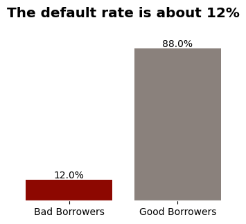

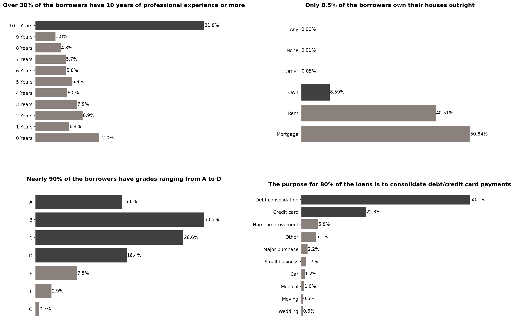

**6.2 Finanzielle Indikatoren:**
- Der maximale Finanzierungsbetrag beträgt 35.000 $, wobei 50 % der Kredite zwischen 8.000 $ und 20.000 $ liegen. Der Durchschnitt liegt bei etwa 14.000 $.
- Die Hälfte der Zinssätze liegt zwischen 11 % und 16,8 %, mit einem maximalen Zinssatz von 26 % und einem minimalen Zinssatz von 5,42 %.
- Das durchschnittliche Jahreseinkommen beträgt 72.970 $, aber dieser Wert kann stark variieren, da auch Personen mit extrem hohem Einkommen enthalten sind. Die Verteilung ist stark rechtsschief.
- Die Hälfte der Kreditnehmer hat eine Schulden-Einkommens-Quote (DTI) von bis zu 16,6 %.
- Die Hälfte hat eine Kreditlinie im Bereich von 13.500 $ bis 37.300 $. Ähnlich wie beim Einkommen kann dieser Wert stark variieren, einschließlich Kreditnehmer mit extrem hohen Kreditlimits.

Die oben genannten Punkte deuten auf ein konservatives Anlageportfolio hin, ohne hohe Finanzierungsbeträge oder übermäßige Zinssätze.

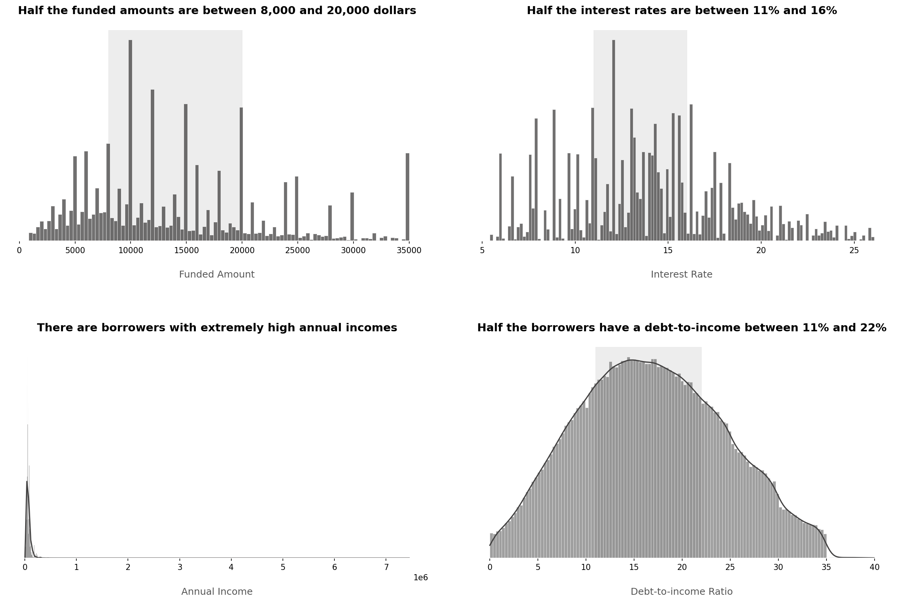

**6.3 Kreditrisiko-Indikatoren:**
- Es gibt einen monotonen Rückgang der Ausfallrate, wenn sich die Kreditnehmer-Bewertung verbessert (von G nach A). Höhere Bewertungen entsprechen einem geringeren Kreditrisiko, wobei die Ausfallrate für G-Bewertungen 6,4-mal höher ist als für A-Bewertungen.
- Die Ausfallrate steigt kontinuierlich mit steigenden Zinssätzen, was darauf hindeutet, dass höhere Zinssätze mit einem höheren Kreditrisiko verbunden sind. Kredite mit mehr als 20 % Zinsen haben eine etwa 8-mal höhere Ausfallrate als Kredite mit Zinsen zwischen 5 % und 7 %.
- Die Ausfallrate sinkt stetig mit steigendem Jahreseinkommen, was darauf hinweist, dass niedrigere Jahreseinkommen mit einem höheren Kreditrisiko verbunden sind. Zum Beispiel haben Personen mit einem Jahreseinkommen zwischen 1.748 $ und 24.111 $ eine etwa doppelt so hohe Ausfallrate wie Personen mit einem Jahreseinkommen von 120.000 $ oder mehr. Das gleiche Muster zeigt sich auch beim Schulden-Einkommens-Verhältnis.

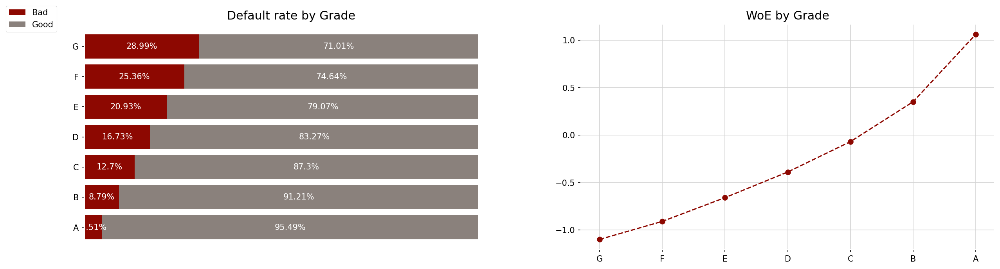

**6.4 Fazit:**
- Es gibt einen steigenden Trend bei der Anzahl der gewährten Kredite über die Zeit.
- Obwohl Lending Club ein konservatives Portfolio hat, ist die Ausfallrate sehr hoch, was unser Projekt motiviert. Das Unternehmen muss Risiken effektiv managen, um den Gewinn zu maximieren und ein stabiles Geschäft zu gewährleisten.
    
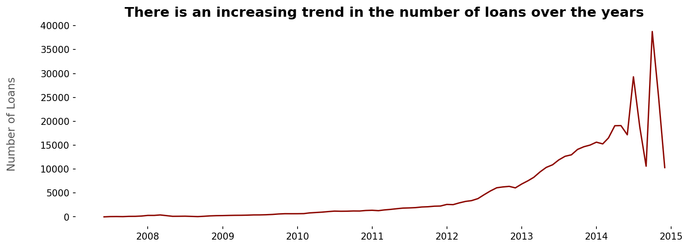

# 7. Modellierung

**7.1 Datenbereinigung:**

- Zuerst wurde Datenbereinigung durchgeführt, um die Rohdaten für die Datenexploration und Modellierung geeignet zu machen. Die in diesem Schritt durchgeführten Aufgaben:
- Erstellen eines sortierten DataFrames, der eine chronologische Reihenfolge für die Kreditdaten bereitstellt.
- Entfernen von Merkmalen mit einer Fehlerrate von mehr als 70%, übermäßiger Kardinalität, einzigartigen Werten pro Beobachtung, fehlender Varianz/konstanten Werten und irrelevanten Variablen aus der Geschäfts- oder Modellierungsperspektive.
- Behandeln von fehlenden Werten, indem Beobachtungen mit fehlenden Werten entfernt werden, wenn sie nur einen sehr kleinen Teil der Daten ausmachen, und sie imputiert werden, wenn sie einen spezifischen Wert darstellen, wie z.B. Null.
- Umwandlung von Merkmalen in den richtigen Datentyp (Objekt in datetime und int).
- Erstellen neuer unabhängiger Merkmale.
- Erstellen der Zielvariablen für die PD (Festlegung einer Standarddefinition für den Ausfall und Zuweisung von 1 für gute Kreditnehmer und 0 für schlechte Kreditnehmer, um positive Koeffizienten als positive Ergebnisse zu interpretieren), EAD (Kreditumwandlungsfaktor) und LGD (Rückzahlungsrate) Modelle.
- Suchen und Beheben inkonsistenter Ausreißerwerte.
- Optimierung des Speichers, Erstellen einer endgültigen Parquet-Datei.
- Als Ergebnis haben wir von 75 Merkmalen auf ein Datenset mit 42 Variablen in den richtigen Datentypen umgeschaltet, das in Bezug auf die Speichernutzung optimiert ist, mit behandelten fehlenden Werten und Ausreißern sowie neuen, nützlichen extrahierten Merkmalen.

**7.2 Explorative Datenanalyse:**

- Das Ziel der explorativen Datenanalyse war es, die persönlichen, finanziellen und kreditrisikobezogenen Indikatoren des aktuellen Investitionsportfolios von Lending Club zu untersuchen, wie bereits zuvor erwähnt. Zusätzlich habe ich in diesem Schritt das endgültige Set an Dummy-Variablen für das PD-Modell festgelegt und im Wesentlichen die Vorverarbeitungsschritte skizziert, die durchgeführt werden sollten.
- Aufgrund der Anforderungen an die Interpretierbarkeit muss das PD-Modell nur Dummy-Variablen enthalten. Um diese Dummies zu erstellen, habe ich die diskriminierende Kraft jeder kategorialen und numerischen Variablen analysiert, indem ich das Weight of Evidence (WoE) für jede Kategorie bewertet habe. Anschließend habe ich mithilfe der WoE-Werte und der Häufigkeit der Beobachtungen Kategorien zusammengefasst, um zusätzliche Dummies zu erstellen. Das Ziel war es, ähnliche Kreditrisiko-/WoE-Kategorien sowie Kategorien mit niedrigen Beobachtungsanteilen zu kombinieren (um Overfitting zu verhindern). Eine wichtige Beobachtung war, dass die höchsten Kreditrisiko- oder niedrigsten WoE-Kategorien, die Referenzkategorien, für das weitere Entfernen separiert wurden, um Multikollinearitätsprobleme (Dummy-Variablenfalle) zu vermeiden.
- Für kontinuierliche Merkmale habe ich Feature-Disretisierung angewendet, um diese kategoriale Analyse zu erleichtern. Die Diskretisierung kontinuierlicher Merkmale ermöglicht ein besseres Verständnis ihrer Beziehung zur Zielvariablen. Dieser Prozess hilft, die Auswirkungen von Ausreißern und Asymmetrien zu minimieren, ermöglicht die Bewertung potenzieller linearer monotoner Verhaltensweisen und bietet die Möglichkeit, Behandlungen anzuwenden, wenn solche Verhaltensweisen nicht beobachtet werden. Es ist jedoch wichtig zu beachten, dass die Diskretisierung mit einer erhöhten Dimensionalität und einem Informationsverlust einhergeht.

**7.3 PD Modeling:**
- In PD modeling, I initially excluded variables that would not be available at the time of prediction to prevent data leakage, such as the funded amount or total payments. Additionally, I eliminated variables that demonstrated no discriminatory power during the Exploratory Data Analysis (EDA).
- Subsequently, I conducted an **out-of-time train-test split**, which is considered the best approach for PD, EAD, and LGD Modeling. This is crucial as we construct models using past data to predict future applicants' data.

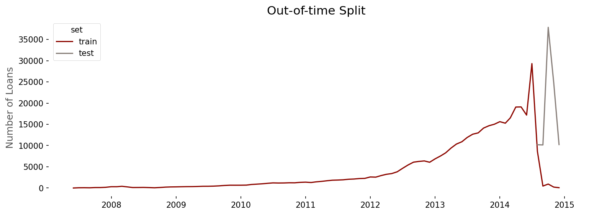

- Following this, I applied the necessary **preprocessing**, creating the **dummy variables** determined in the EDA step. I discretized the identified continuous features and then grouped all the specified categories to obtain the final dummies, eliminating the respective reference categories. An important observation is that I considered missing values in a variable as another category of it, because they showed a higher proportion of defaults, not being missing values at random.
- Once the data was preprocessed, I estimated the **PD Model using hypothesis testing to evaluate p-values** for the predictor variables. This helped determine whether these variables were statistically significant (i.e., had a coefficient different from zero) or not.
- Independent variables with all dummies containing p-values higher than an alpha of 0.05 were removed, simplifying the model.
- **Interpretation of the coefficients** was performed. For instance, considering the coefficient for sub_grade_A3_A2_A1 as 0.694287, we can infer that the odds of being classified as good for a borrower with A1/A2/A3 subgrades are exp(0.694287) = 2.0 times greater than the odds for someone with G1/G2/G3/G4/G5/F2/F3/F4/F5 subgrades (the reference category).
- Subsequently, I **evaluated the PD Model** by dividing the **scores** into **deciles** and assessing whether there was **ordering** in them. Indeed, in both the training and test data, there was a clear ordering: the lower the credit risk or the higher the score, the lower the bad rate. Moreover, more than 50% of the bad borrowers were observed up to the third decile/score.

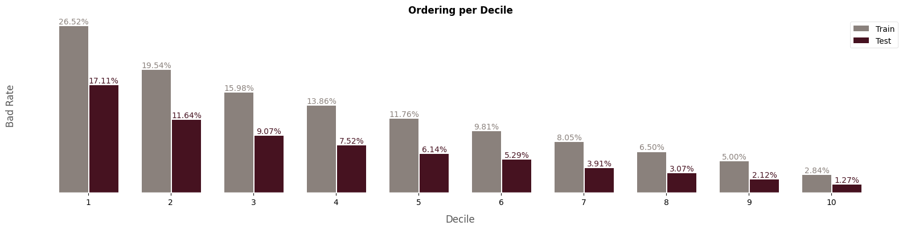

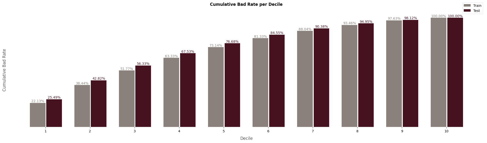

- Furthermore, with a **KS** of approximately **0.3**, an **ROC-AUC** of around **0.7**, and a **Gini** coefficient of about **0.4** on the test set, the application model exhibits **satisfactory performance**. The model demonstrates effective discriminatory power, distinguishing well between good and bad borrowers. Examining the **Brier** Score, it is very **close to zero**, indicating that the model presents **well-calibrated probabilities** or scores. Furthermore, the **train and test scores** for each of these metrics are quite **similar**. Consequently, the model is not overfitted, has captured the underlying patterns within the data, and is likely to distinguish well between good and bad borrowers in new, unseen data.

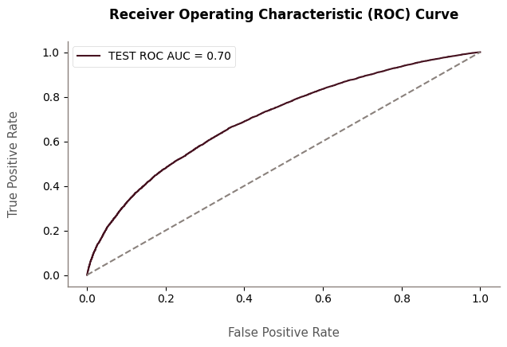

| Metric | Train Value | Test Value |
|--------|-------------|------------|
| KS     | 0.268181    | 0.297876   |
| AUC    | 0.683655    | 0.703449   |
| Gini   | 0.367310    | 0.406897   |
| Brier  | 0.100512    | 0.061633   |

- Finally, a **scorecard** was developed, transforming the coefficients from the PD Model into easily interpretable integer values known as scores. Various formulas were employed to compute these scores, with a minimum score of 300 and a maximum of 850. Subsequently, **credit scores** were **calculated for all borrowers** in both the training and test datasets by multiplying each dummy by its scores and summing the intercept.

**7.4 EAD and LGD Modeling:**
- Initially, I **isolated data containing defaulted loans with a "charged off" status**, ensuring sufficient time had passed for potential recoveries.
- Similar to the PD Model, I excluded irrelevant variables and those that could introduce data leakage.
- Subsequently, I performed an **out-of-time train-test split**, following the same approach as with the PD Model.
- Following this, I **investigated both dependent variables:**
    - The dependent variable for the **LGD Model** is the **recovery rate**, defined as recoveries divided by the funded amount. Although LGD represents the proportion of the total exposure that cannot be recovered by the lender when the borrower defaults, it is common to model the proportion that CAN be recovered. Thus, **LGD** will be equal to **1 minus the Recovery Rate.**
    - The dependent variable for the **EAD model** is the **credit conversion factor**, representing the proportion of the funded amount outstanding to pay. Therefore, **EAD** equals the **funded amount multiplied by this credit conversion factor.**
    - Almost **50% of the recovery rates were zero.** Consequently, I opted to **model LGD using a two-stage approach**. First, a logistic regression predicts whether the recovery rate is greater than zero (1) or zero (0). Then, for those predicted as greater than zero, a linear regression estimates its corresponding value.
    - The credit conversion factor exhibited a reasonable distribution, leading me to decide on estimating a simple linear regression.
    - An important observation is that, although LGD and EAD are beta-distributed dependent variables, representing rates, and beta regression is more suitable for estimating them, I tested it against Linear Regression, and almost the same result was achieved. Thus, considering the need to treat 0 and 1 values for beta regression (e.g., replacing them with 0.0001 and 0.9999), for simplicity, I proceeded with linear regression.
- **Data preprocessing** involved one-hot encoding for nominal categorical variables, as linear models benefit from this encoding. For ordinal categorical variables, ordinal encoding was applied to reduce dimensionality and preserve ordering information. Standard scaling was applied to both ordinal encoded and numerical variables since linear models are sensitive to feature scaling. Missing values were imputed with the median due to an extremely right-skewed variable distribution.
- I estimated the two-stage LGD and EAD Models. For LGD, I combined the two predictions by taking their product. Predictions from the first stage logistic regression that predicted a recovery rate of zero remained zero, while those predicted as one received the estimated value from the second stage linear regression.
- The **results were satisfactory**, although not impressive. Both models' **residuals distributions resembled a normal curve**, with most values around zero. Additionally, some tails were observed, indicating that the LGD Model tends to underestimate the recovery rate, and the EAD tends to overestimate it. However, with a **Mean Absolute Error (MAE) of 0.0523 and 0.1353** for the LGD and EAD Models, respectively, the models provide useful predictions. On average, the predicted recovery rates deviate by approximately 5.23 percentage points from the actual values. On average, the predicted credit conversion rates deviate by approximately 13.53 percentage points from the actual values.

Residuals distribution and actual vs predicted values for the LGD Model.

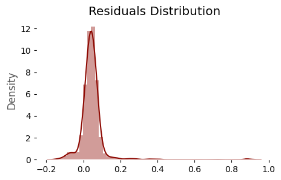

| Actual | Predicted | Residual |
|--------|-----------|----------|
| 0.06   | 0.10      | 0.05     |
| 0.15   | 0.10      | 0.05     |
| 0.14   | 0.15      | 0.01     |
| 0.16   | 0.12      | 0.05     |
| 0.15   | 0.09      | 0.06     |

Residuals distribution and actual vs predicted values for the EAD Model.

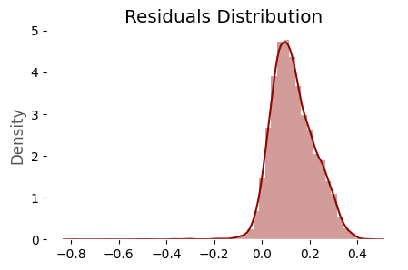

| Actual | Predicted | Residual |
|--------|-----------|----------|
| 0.93   | 0.82      | 0.11     |
| 0.90   | 0.84      | 0.06     |
| 0.73   | 0.64      | 0.09     |
| 0.96   | 0.64      | 0.31     |
| 0.64   | 0.70      | 0.06     |

**7.5 Expected Loss (EL) and Credit Policy:**
- To compute **Expected Loss (EL)**, which is the **product of Probability of Default (PD), Exposure at Default (EAD), and Loss Given Default (LGD)**, I leveraged the results of the three models (PD, EAD, and LGD Models) on the test data used for testing the PD Model, encompassing both default and non-default loans.
- I **created 10 risk classes (AA, A, AB, BB, B, BC, C, CD, DD, F)** based on the probability of default because this way we can better leverage the results of the credit scoring model, and it is possible to establish different policies for individuals in different risk classes.
- In this context, **Lending Club** is adopting a more **conservative profile** with a focus on the **profitability** of its assets. The goal is to mitigate risks associated with higher-risk and potential default loans while maximizing profitability.
- To achieve this, the **CEO has outlined a conservative credit policy:** We will automatically approve loans for applicants who fall into AA and A risk classes (indicating the lowest credit risk and highest credit scores) and automatically deny those who fall into the F class (indicating the highest credit risk and lowest credit scores). For the other classes, the loan must provide an annualized Return on Investment (ROI) greater than the basic United States interest rate. This criterion aligns with the rationale that if a loan's expected ROI doesn't surpass this interest rate, it may be more prudent to invest in less risky options, such as fixed-income investments.
- Considering the data goes up until 2015, I assumed that the United States has a basic interest rate of 2.15%.
- As a **financial result**, with our simple credit policy rules, by rejecting just 11% of the loans (including those belonging to the worst risk class, F, and those with an annualized ROI lower than 2.15, the basic US interest rate), both the amount Lending Club expects to lose in its assets and the default rate decreased. Specifically, the **default rate decreased from 6.71% to 5.65%** and the **Expected Loss decreased from 6.91% to 5.77%.** Although these represent **little percentage points** decreasement, when dealing with **thousands of loans** and funded amounts, it represents a **substantial financial gain to Lending Club.** Furthermore, other policies can also be designed, in a more restrictive or free way. This is just a draw to show that our project is worthwile.

**7.6 Model Monitoring:**
- Imagine a year has passed since we built our PD model. Although it is very unlikely, the people applying for loans now might be very different from those we used to train our PD model. We need to reassess if our PD model is working well.
- If the population of the new applicants is too different from the population we used to build the model, the results may be disastrous. In such cases, we need to redevelop the model.
- I applied **model monitoring to our PD Model one year after its construction, using 2015 loan data**. Model monitoring aims to observe whether applicants' characteristics remain consistent over time. The fundamental assumption in credit risk models is that future data will resemble past data. If the population changes significantly, it may be necessary to retrain the model. To assess differences between the actual (training data) and expected (monitoring data), the **Population Stability Index (PSI)** was calculated for each variable.
- Initial list status exhibited the highest PSI, nearly equal to 0.25, indicating a substantial change in the applicants' population. However, this change is more likely due to shifts in the bank's strategies than changes in the borrowers' characteristics.
- On the other hand, **credit scores** showed a PSI of 0.19, close to 0.25. This suggests that we may need to construct another PD Model in the near future. This represents a **significant population change, implying that our model outputs are considerably different from those observed previously.**

**7.7 Next steps:**
- Considering the 2015 applicants' profile has changed, especially the scores distribution, the next steps involve constructing a new PD Model utilizing more robust methods, such as boosting algorithms, focusing on predictive power and trying to use machine learning interpretability tools such as SHAP and LIME.
- As a final product, I intend to deploy these models on production environment.

# 8. Obtain the Data
- The data was collected from kaggle and contain complete loan data for all loans issued through the 2007-2015, including the current loan status (Current, Late, Fully Paid, etc.) and the latest payment information.
- https://www.kaggle.com/datasets/wordsforthewise/lending-club

# 9. Run this Project on Your Local Machine
- An important observation is that, due to the large size of the data, it was not possible to push it to GitHub. To replicate the same results, please download the data from the link provided in topic 8 and read it into the data cleaning notebook. The cleaned data is saved in the input directory, so after the data cleaning process, everything should run smoothly.

Prerequisites:

Before getting started, make sure you have the following installed on your machine:
- Python 3.11.5
- pip (Python package manager)
- Git (Version control tool)

Once you have this installed, open a terminal on your local machine and run the following commands:

1. Clone the repository:
<pre>
git clone https://github.com/allmeidaapedro/Lending-Club-Credit-Scoring.git
</pre>

2. Navigate to the cloned repository directory:
<pre>
cd Lending-Club-Credit-Scoring
</pre>

3. Create a virtual environment:
<pre>
python -m venv venv
</pre>

4. Activate the Virtual Environment:

Activate the virtual environment used to isolate the project dependencies.
<pre>
source venv/bin/activate  # On Windows, use 'venv\Scripts\activate'
</pre>

5. Install Dependencies:

Use pip to install the required dependencies listed in the requirements.txt file.
<pre>
pip install -r requirements.txt
</pre>

6. Run the notebooks in the notebooks directory and reproduce the same results.

7. Deactivate the Virtual Environment:

When you're done with the project, deactivate the virtual environment.

<pre>
deactivate
</pre>

# 10. Contact me
- Linkedin: https://www.linkedin.com/in/pedro-almeida-ds/
- Github: https://github.com/allmeidaapedro
- Gmail: pedrooalmeida.net@gmail.com

Lending-Club-Credit-Scoring/
│
├── data/                 # Rohdaten, externe Datenquellen
│   ├── raw/             
│   └── processed/       
│
├── notebooks/            # Jupyter Notebooks
│   ├── 1_data_cleaning.ipynb
│   ├── 2_feature_engineering.ipynb
│   └── 3_model_training.ipynb
│
├── scripts/              # Python-Skripte (ausgelagerter Code)
│   ├── data_cleaning.py
│   └── utils.py
│
├── outputs/              # Ergebnisse (Modelle, Bilder, Tabellen)
│   ├── figures/         
│   └── models/          
│
├── environment.yml       # Anaconda-Umgebungsdatei
├── README.md             # Projektbeschreibung
└── requirements.txt      # Pip-Paketliste (optional)
